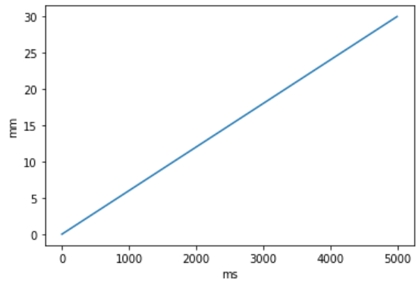

# physipy

[](https://pypi.org/project/physipy/)
[](https://pypi.org/project/physipy/)
[](https://physipy.readthedocs.io/en/latest/)
[](https://mocquin.github.io/physipy/)
[](https://github.com/astral-sh/ruff)
[](https://mypy-lang.org/)
[](https://github.com/pre-commit/pre-commit)
[](https://pepy.tech/project/physipy)
[](LICENSE)
[](https://mybinder.org/v2/gh/mocquin/physipy/HEAD)

**physipy** lets you manipulate *physical quantities* in Python — the association
of a value (a scalar, a `numpy.ndarray`, and more) with a *physical unit* (such
as meter or joule). Dimensional consistency is enforced automatically, so adding
a length to a time raises an error instead of producing nonsense.

```python
>>> from physipy import units, constants
>>> nm = units["nm"]      # nanometer
>>> hp = constants["h"]   # Planck's constant
>>> c  = constants["c"]   # speed of light
>>> E_ph = hp * c / (500 * nm)   # energy of a 500 nm photon
>>> print(E_ph)
3.9728916483435158e-19 kg*m**2/s**2
>>> E_ph.favunit = units["J"]    # choose a display ("favourite") unit
>>> print(E_ph)
3.9728916483435158e-19 J
```

- 📖 **Documentation:** https://physipy.readthedocs.io/en/latest/
- 🚀 **Quickstart:** https://physipy.readthedocs.io/en/latest/quickstart.html
- 🧪 **Try it live (Binder):** [launch a session](https://mybinder.org/v2/gh/mocquin/physipy/HEAD),
  then open any notebook under `docs/scientific-stack/`.
- 🐍 **PyPI:** https://pypi.org/project/physipy/
- 💻 **Source:** https://github.com/mocquin/physipy

## Installation

physipy is published on [PyPI](https://pypi.org/project/physipy/). The core only
needs numpy:

```bash
pip install physipy
```

Heavier dependencies are **optional extras** — install only what you use:

| Extra        | Enables                                                        | Pulls in     |
| ------------ | ------------------------------------------------------------- | ------------ |
| `calculus`   | `physipy.calculus` (integration / ODE / root finding)         | scipy        |
| `constants`  | physical-constant values in `physipy.constants`               | scipy        |
| `plotting`   | unit-aware matplotlib integration (`setup_matplotlib`)        | matplotlib   |
| `symbolic`   | compound dimension parsing (`Dimension("L**2/T")`) and LaTeX  | sympy        |
| `all`        | everything above                                              | all of them  |

```bash
pip install "physipy[plotting]"   # core + matplotlib integration
pip install "physipy[all]"        # everything
```

If you use an optional feature without its dependency installed, physipy raises a
clear, actionable `ImportError` telling you which extra to install.

To work from source:

```bash
git clone https://github.com/mocquin/physipy
cd physipy
pip install -e ".[all]"
```

## Why physipy?

- **Light-weight** — two core classes (`Dimension` and `Quantity`) plus a few
  helpers; the rest is convenience.
- **Great numpy support** — 150+ functions and ufuncs work transparently on
  quantities (see below).
- **pandas support** via the companion package [`physipandas`](https://github.com/mocquin/physipandas).
- **matplotlib support** — unit-aware axes with a single `setup_matplotlib()` call.
- **Fast** — on par with or faster than the main alternative packages, for both
  scalars and arrays.
- Extensively unit-tested, performance tracked with
  [airspeed velocity](https://asv.readthedocs.io/), and shipped with inline type
  hints (PEP 561).

### Project goals

- Few lines of code.
- A simple architecture, built around only two classes (`Dimension` and `Quantity`).
- High numpy compatibility.
- Human-readable, fast-to-write syntax.

## How it works

- A **`Dimension`** represents a [physical dimension](https://en.wikipedia.org/wiki/Dimensional_analysis),
  based on the [SI system](https://en.wikipedia.org/wiki/International_System_of_Units).
  It is essentially a dict mapping each base dimension to its exponent.
- A **`Quantity`** is the association of a value (scalar, array, …) with a
  `Dimension`. It does *not* subclass `numpy.ndarray`, yet stays compatible with
  numpy ufuncs. Most of the work lives in this class.
- By default a `Quantity` is displayed in SI units. Set its `favunit` (favourite
  unit) to display it differently — `my_toe_length.favunit = mm`.
- Plenty of units (e.g. watt) and constants (e.g. the speed of light) ship with
  physipy. Your quantities, units, and constants are all `Quantity` objects.

## numpy support

```python
import numpy as np
from physipy import m, units

mm = units["mm"]

lengths = np.linspace(-3 * m, 4.5 * m, num=12)
print(lengths[4])
print(lengths.mean())
```

numpy is handled almost fully and transparently: basic operations, indexing,
numpy functions and universal functions all work. Over 150 functions are
implemented. A few limitations remain, but they can be worked around — see the
[numpy support page](https://physipy.readthedocs.io/en/latest/scientific-stack/numpy-support.html).

## pandas support

pandas integrates with physipy through its extension API, provided by the
companion package [`physipandas`](https://github.com/mocquin/physipandas):

```python
import numpy as np
import pandas as pd
from physipy import m
from physipandas import QuantityDtype, QuantityArray

c = pd.Series(QuantityArray(np.arange(10) * m), dtype=QuantityDtype(m))

print(type(c))                  # <class 'pandas.core.series.Series'>
print(c.physipy.dimension)      # L
print(c.physipy.values.mean())  # 4.5 m
```

See the [physipandas repository](https://github.com/mocquin/physipandas) for more.

## matplotlib support

Call `setup_matplotlib()` once and matplotlib will label axes with units
automatically:

```python
import numpy as np
import matplotlib.pyplot as plt
from physipy import s, m, units, setup_matplotlib

setup_matplotlib()        # make matplotlib physipy-aware
mm = units["mm"]
ms = units["ms"]

x = np.linspace(0, 5) * s
x.favunit = ms
y = np.linspace(0, 30) * mm
y.favunit = mm

fig, ax = plt.subplots()
ax.plot(x, y)
```

[](https://physipy.readthedocs.io/en/latest/scientific-stack/matplotlib-support.html)

See the [matplotlib support page](https://physipy.readthedocs.io/en/latest/scientific-stack/matplotlib-support.html).

## Widgets

A set of ipywidgets and PyQt widgets that understand units is available in a
separate package, to make interactive exploration of results easier.

## Performance

physipy's performance is tracked with
[airspeed velocity](https://asv.readthedocs.io/); results are published at
https://mocquin.github.io/physipy/. A quick benchmark shows physipy is as fast as
(or faster than) other well-known packages, for both scalars and arrays.


For an in-depth comparison see the
[quantities-comparison repository](https://github.com/mocquin/quantities-comparison).

## Alternative packages

There are many Python packages handling physical quantities. A non-exhaustive
list (roughly by popularity):

[astropy](http://www.astropy.org/astropy-tutorials/Quantities.html) ·
[sympy](https://docs.sympy.org/latest/modules/physics/units/philosophy.html) ·
[pint](https://pint.readthedocs.io/en/latest/) ·
[forallpeople](https://github.com/connorferster/forallpeople) ·
[unyt](https://github.com/yt-project/unyt) ·
[python-measurement](https://github.com/coddingtonbear/python-measurement) ·
[Unum](https://bitbucket.org/kiv/unum/) ·
[scipp](https://scipp.github.io/reference/units.html) ·
[magnitude](http://juanreyero.com/open/magnitude/) ·
[numericalunits](https://github.com/sbyrnes321/numericalunits) ·
[buckingham](https://github.com/mdipierro/buckingham) ·
[quantities](https://pythonhosted.org/quantities/user/tutorial.html) ·
[brian](https://brian2.readthedocs.io/en/stable/user/units.html) ·
[quantiphy](https://github.com/KenKundert/quantiphy) ·
[pynbody](https://github.com/pynbody/pynbody) ·
[pyansys-units](https://github.com/ansys/pyansys-units) ·
[natu](https://github.com/kdavies4/natu) ·
[misu](https://github.com/cjrh/misu) ·
[openscm-units](https://github.com/openscm/openscm-units) ·
and [pysics](https://bitbucket.org/Phicem/pysics), from which physipy was
originally inspired.

Know another one? Contributions are welcome. For broader context, see this
[quantities-comparison](https://github.com/tbekolay/quantities-comparison) repo,
[this talk](https://www.youtube.com/watch?v=N-edLdxiM40), and this
[comparison table](https://socialcompare.com/en/comparison/python-units-quantities-packages).

## Development

```bash
git clone https://github.com/mocquin/physipy
cd physipy
uv sync --all-extras            # or: pip install -e ".[all]" --group dev
pre-commit install              # enable lint/format/type hooks on commit

pytest                          # run the test suite
ruff check . && ruff format .   # lint + format
mypy                            # type-check
mkdocs serve                    # preview the docs locally
```

Building distributions:

```bash
python -m build       # or: uv build
```

## License

physipy is released under the MIT License — see [LICENSE](LICENSE).

## Acknowledgment

Hat tip to phicem and the [pysics](https://bitbucket.org/Phicem/pysics) package,
which inspired physipy. Check it out!
