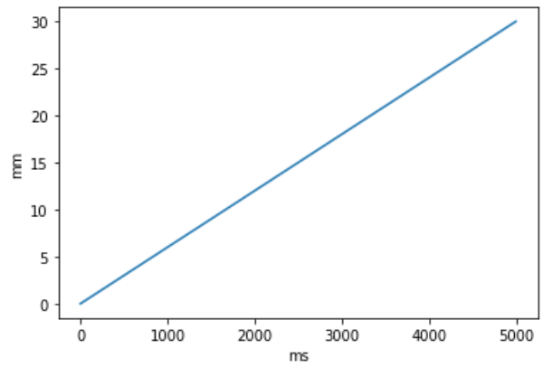
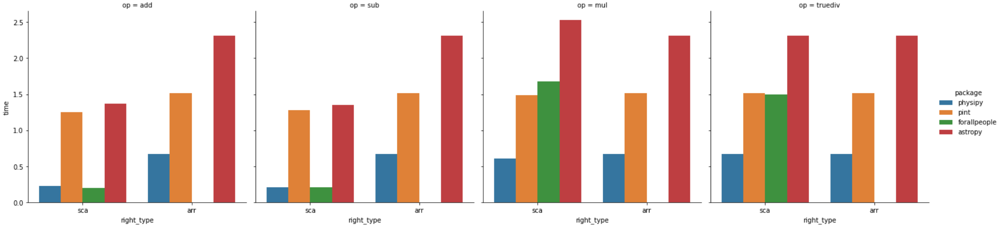
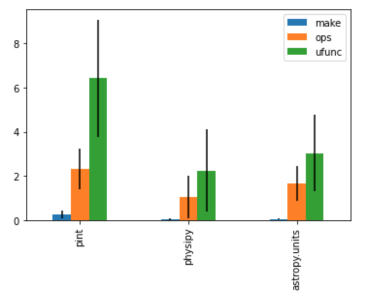

# physipy
[](https://mybinder.org/v2/gh/mocquin/physipy/HEAD)
[](https://pypi.org/project/physipy/)
[](https://physipy.readthedocs.io/en/latest/)
[](https://mocquin.github.io/physipy/)
[](https://github.com/psf/black)
[](https://github.com/pre-commit/pre-commit)
[](https://mypy-lang.org/)
[](https://pepy.tech/project/physipy)

This python package allows you to manipulate physical quantities, basically considering in the association of a value (scalar, numpy.ndarray and more) and a physical unit (like meter or joule).

```python
>>> from physipy import units, constants
>>> nm = units['nm']    # nanometer
>>> hp = constants['h'] # Planck's constant
>>> c  = constants['c'] # speed of light
>>> E_ph = hp * c / (500 * nm) # energy of a photon at wavelength 500nm
>>> print(E_ph)
3.9728916483435158e-19 kg*m**2/s**2
>>> J = units['J'] # Joule
>>> E_ph.favunit = J # set the favourite unit for display/print
>>> print(E_ph)
3.9728916483435158e-19 J
```

For a quickstart, check the [quickstart notebook](https://github.com/mocquin/physipy/blob/master/quickstart.ipynb) on the [homepage](https://github.com/mocquin/physipy)

## Documentation [](https://physipy.readthedocs.io/en/latest/)
Full documentation of `physipy` is available here : [https://physipy.readthedocs.io/en/latest/](https://physipy.readthedocs.io/en/latest/), generated with mkdocs and hosted on readthedocs.

## Try physipy online now [](https://mybinder.org/v2/gh/mocquin/physipy/HEAD)  
Get a live python session with physipy [by clicking here](https://mybinder.org/v2/gh/mocquin/physipy/HEAD). After a while, you'll get an interactive notebook session, then open the `quiskstart.ipynb` notebook in the left panel.

## Installation
The latest release of physipy is available on [pypi] at [https://pypi.org/project/physipy/](https://pypi.org/project/physipy/).
Hence the easiest way to install physipy is using pip : 
```
pip install physipy
```

Latest source code is hosted on Github at [https://github.com/mocquin/physipy/](https://github.com/mocquin/physipy/).
You can download and un-zip the package localy, or clone the git repository with : 
```
git clone https://github.com/mocquin/physipy
```
For more information, see [here](https://docs.github.com/fr/repositories/creating-and-managing-repositories/cloning-a-repository).

## Why choose this package  
Here are some reasons that might encourage you to choose this package for quantity/physical/units handling in python : 

 - Light-weight package (2 classes, few helper functions - the rest is convenience)
 - Great numpy compatibility (see below)
 - Great pandas compatibility (see below)
 - Great matplotlib compatibility (see below)
 - As fast (if not faster) than the main other units packages (see below)

Also : 

 - lots of unit tests
 - computation performances tracked with airspeed-velocity (see below)
 - Jupyter widgets that handle units (as ipywidgets and Qt, see below)

## Goals of the project
The project focuses on keeping these goals in the center of any new development : 

- Few LOC
- Simple architecture, with only 2 classes (namely `Dimension` and `Quantity`)
- High numpy compatibility
- Human-readable syntax (fast syntax !)
 
## Implementation approach

If you're only interested in using physipy, you don't need to understand this part (thou it wouldn't hurt to read it) : 

- a `Dimension` object represents a [physical dimension](https://en.wikipedia.org/wiki/Dimensional_analysis). For now, these dimension are based on the [SI unit](https://en.wikipedia.org/wiki/International_System_of_Units). It is basically a dictionary where the keys represent the base dimensions, and the values are the exponent these dimensions.
- a `Quantity` object is simply the association of a value, scalar or array (or more!), and a `Dimension` object. Note that this `Quantity` class does not sub-class numpy's `ndarray` (although `Quantity` instances are compatible with numpy's ufuncs, see below). **Most of the work is done by this class**.
- By default, a `Quantity` is displayed in term of SI untis. To express a `Quantity` in another unit, just set the "favunit", which stands for "favorit unit" of the `Quantity` : ```my_toe_length.favunit = mm```.
- Plenty of common units (ex : Watt) and constants (ex : speed of light) are packed in. Your physical quantities (```my_toe_length```), units (```kg```), and constants (```kB```) are all `Quantity` objects.

## Numpy's support

One the biggest strength of physipy is its numpy support :

```python
import numpy as np
from physipy import m, units

mm = units['mm']

lengths = np.linspace(-3*m, 4.5*m, 12*mm)
print(lengths[4])
print(lengths.mean())
```

Numpy is almost fully and transparently handled in physipy : basic operations, indexing, numpy functions and universal functions are handled. There are more than 150 functions implemented ! Some limitations still exist but can be can be circumvented.
See the [documentation for numpy support](https://physipy.readthedocs.io/en/latest/scientific-stack/numpy-support.html).

## Pandas' support

Pandas can be interfaced with physipy through the extension API exposed by pandas. For this, just install the package [`physipandas`](https://github.com/mocquin/physipandas). You can then use `pd.Series` and `pd.DataFrame` whilst keeping the meaningfull units. Checkout the dedicated repo for [physipandas](https://github.com/mocquin/physipandas) for more information.

```python
import pandas as pd
import numpy as np
from physipy import m
from physipandas import QuantityDtype, QuantityArray

# definition is a bit verbose...
c = pd.Series(QuantityArray(np.arange(10)*m), 
              dtype=QuantityDtype(m))

print(type(c))                 # --> <class 'pandas.core.series.Series'>
print(c.physipy.dimension)     # --> : L
print(c.physipy.values.mean()) # --> : 4.5 m
c

0   0
1   1
2   2
3   3
4   4
5   5
6   6
7   7
8   8
9   9
dtype: physipy[1 m]
```

## Matplotlib's units support

Matplotlib allows defining a physical units interface, which can be turned-on using physipy's `setup_matplotlib`, all plot involving a physical quantity will automatically label the axis accordingly : 
```python
import numpy as np
import matplotlib.pyplot as plt
from physipy import s, m, units, setup_matplotlib
setup_matplotlib() # make matplotlib physipy's units aware
mm = units["mm"]   # get millimiter
ms = units["ms"]   # get millisecond

# physipy work
x = np.linspace(0, 5) * s
x.favunit = ms 
y = np.linspace(0, 30) * mm
y.favunit = mm 

# standard matplotlib
fig, ax = plt.subplots()
ax.plot(x, y)
```

[](https://physipy.readthedocs.io/en/latest/scientific-stack/matplotlib-support.html)

Checkout the [matplotlib page on physipy documentation](https://physipy.readthedocs.io/en/latest/scientific-stack/matplotlib-support.html).

## Widgets

Some ipywidgets and PyQt widgets are provided to make your physical researches and results more interactive : everything is stored in a separate package.

## Alternative packages

A quick performance benchmark show that physipy is just as fast (or faster) than other well-known physical packages, both when computing scalars (int or float) and numpy arrays :  



For a more in-depth comparison, checkout this repository (not maintenained but it should!) : https://github.com/mocquin/quantities-comparison : 



There are plenty of python packages that handle physical quantities computation. Some of them are full packages while some are just plain python module. Here is a list of those I could find (approximately sorted by guessed-popularity) :

 - [astropy](http://www.astropy.org/astropy-tutorials/Quantities.html)
 - [sympy](https://docs.sympy.org/latest/modules/physics/units/philosophy.html)
 - [pint](https://pint.readthedocs.io/en/latest/)
 - [forallpeople](https://github.com/connorferster/forallpeople)
 - [unyt](https://github.com/yt-project/unyt)
 - [python-measurement](https://github.com/coddingtonbear/python-measurement)
 - [Unum](https://bitbucket.org/kiv/unum/)
 - [scipp](https://scipp.github.io/reference/units.html)
 - [magnitude](http://juanreyero.com/open/magnitude/)
 -  physics.py : there are actually several packages based on the same core code : [ipython-physics](https://bitbucket.org/birkenfeld/ipython-physics) (python 2 only) and [python3-physics](https://github.com/TheGrum/python3-physics) (python 3 only)
 - [ScientificPython.Scientific.Physics.PhysicalQuantities](https://github.com/ScientificPython/ScientificPython)
 - [numericalunits](https://github.com/sbyrnes321/numericalunits)
 - [dimensions.py](https://code.activestate.com/recipes/577333-numerical-type-with-units-dimensionspy/) (python 2 only)
 - [buckingham](https://github.com/mdipierro/buckingham)
 - [units](https://bitbucket.org/adonohue/units/)
 - [quantities](https://pythonhosted.org/quantities/user/tutorial.html)
 - [physical-quantities](https://github.com/hplgit/physical-quantities)
 - [brian](https://brian2.readthedocs.io/en/stable/user/units.html)
 - [quantiphy](https://github.com/KenKundert/quantiphy)
 - [parampy](https://github.com/matthewwardrop/python-parampy/blob/master/parampy/quantities.pyx)
 - [pynbody](https://github.com/pynbody/pynbody)
 - [python-units](https://pypi.org/project/python-units/)
 - [pyansys-units](https://github.com/ansys/pyansys-units/tree/main) (forked from pint?)
 - [natu](https://github.com/kdavies4/natu)
 - [misu](https://github.com/cjrh/misu)
 - [units](https://github.com/IAMconsortium/units)
 - [physunits](https://github.com/pacosalces/physunits) 
 - [openscn](https://github.com/openscm/openscm-units)
 - and finally [pysics](https://bitbucket.org/Phicem/pysics) from which this package was inspired

If you know another package that is not in this list yet, feel free to contribute ! Also, if you are interested in the subject of physical quantities packages in python, check this [quantities-comparison](https://github.com/tbekolay/quantities-comparison) repo and [this talk](https://www.youtube.com/watch?v=N-edLdxiM40). Also check this [comparison table](https://socialcompare.com/en/comparison/python-units-quantities-packages) and [this talk](https://pyvideo.org/pycon-ca-2012/writing-self-documenting-scientific-code-using-ph.html).

Some C/C++ alternatives :  
 - [units](https://units.readthedocs.io/en/latest/index.html)

## Performance [](https://mocquin.github.io/physipy/)
Performance of `physipy` are tracked using [`airspeedvelocity`](https://asv.readthedocs.io/en/v0.6.1/). Results are available at [https://mocquin.github.io/physipy/](https://mocquin.github.io/physipy/).
[](https://mocquin.github.io/physipy/)

## License

This project is licensed under the MIT License - see the [LICENSE.md](LICENSE.md) file for details

## Acknowledgment

Thumbs up to phicem and his [pysics](https://bitbucket.org/Phicem/pysics) package, on which this package was highly inspired. Check it out !
