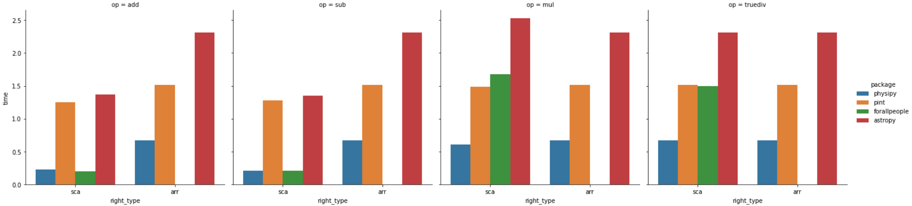
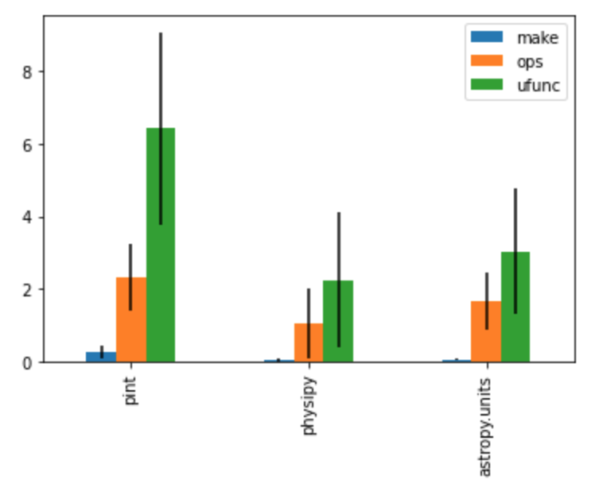

## Alternative packages to handle physical units in python

### List of solutions 

There are plenty of python packages that handle physical quantities computation. Some of them are full packages while some are just plain python module. Here is a list of those I could find (approximately sorted by guessed-popularity) :

 - [astropy](http://www.astropy.org/astropy-tutorials/Quantities.html)
 - [sympy](https://docs.sympy.org/latest/modules/physics/units/philosophy.html)
 - [pint](https://pint.readthedocs.io/en/latest/)
 - [forallpeople](https://github.com/connorferster/forallpeople)
 - [unyt](https://github.com/yt-project/unyt)
 - [python-measurement](https://github.com/coddingtonbear/python-measurement)
 - [Unum](https://bitbucket.org/kiv/unum/)
 - [scipp](https://scipp.github.io/reference/units.html)
 - [magnitude](http://juanreyero.com/open/magnitude/)
 -  physics.py : there are actually several packages based on the same core code : [ipython-physics](https://bitbucket.org/birkenfeld/ipython-physics) (python 2 only) and [python3-physics](https://github.com/TheGrum/python3-physics) (python 3 only)
 - [ScientificPython.Scientific.Physics.PhysicalQuantities](https://github.com/ScientificPython/ScientificPython)
 - [numericalunits](https://github.com/sbyrnes321/numericalunits)
 - [dimensions.py](https://code.activestate.com/recipes/577333-numerical-type-with-units-dimensionspy/) (python 2 only)
 - [buckingham](https://github.com/mdipierro/buckingham)
 - [units](https://bitbucket.org/adonohue/units/)
 - [quantities](https://pythonhosted.org/quantities/user/tutorial.html)
 - [physical-quantities](https://github.com/hplgit/physical-quantities)
 - [brian](https://brian2.readthedocs.io/en/stable/user/units.html)
 - [quantiphy](https://github.com/KenKundert/quantiphy)
 - [parampy](https://github.com/matthewwardrop/python-parampy/blob/master/parampy/quantities.pyx)
 - [pynbody](https://github.com/pynbody/pynbody)
 - [python-units](https://pypi.org/project/python-units/)
 - [natu](https://github.com/kdavies4/natu)
 - [misu](https://github.com/cjrh/misu)
 - [units](https://github.com/IAMconsortium/units)
 - [openscn](https://github.com/openscm/openscm-units)
 - and finally [pysics](https://bitbucket.org/Phicem/pysics) from which this package was inspired

If you know another package that is not in this list yet, feel free to contribute ! Also, if you are interested in the subject of physical quantities packages in python, check this [quantities-comparison](https://github.com/tbekolay/quantities-comparison) repo and [this talk](https://www.youtube.com/watch?v=N-edLdxiM40). Also check this [comparison table](https://socialcompare.com/en/comparison/python-units-quantities-packages) and [this talk](https://pyvideo.org/pycon-ca-2012/writing-self-documenting-scientific-code-using-ph.html).

Some C/C++ alternatives :  
 - [units](https://units.readthedocs.io/en/latest/index.html)

### How physipy stands out

A quick performance benchmark show that physipy is just as fast (or faster) than other well-known physical packages, both when computing scalars (int or float) and numpy arrays :  

For a more in-depth comparison, checkout (not maintenained, but it should!) : [https://github.com/mocquin/quantities-comparison](https://github.com/mocquin/quantities-comparison).

