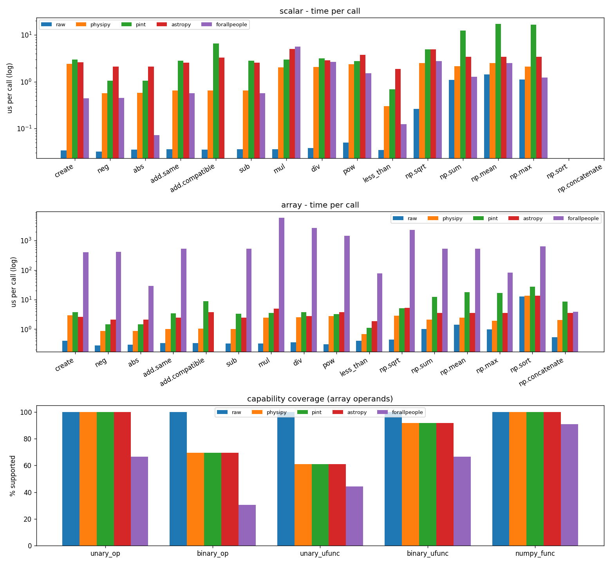

# Comparison with other packages

Python has a surprisingly large number of packages for working with physical
quantities and units. This page compares the most popular ones with physipy —
their design choices, strengths, and trade-offs — so you can pick the right tool
for your problem. The aim is to be fair: physipy is not the best choice for every
use case, and this page tries to make clear when another package fits better.

## At a glance

| Package | Quantity model | Unit registry? | Angles as a dimension | Core dependency | Best suited for |
| --- | --- | --- | --- | --- | --- |
| **physipy** | wrapper (value + `Dimension`), *not* an `ndarray` subclass | no — units are module-level objects | **yes** (`rad`, `sr` are base dimensions) | numpy only | general scientific/engineering code that wants a lean, numpy-friendly library |
| **pint** | wrapper (magnitude + `Unit`), tied to a registry | **yes** — `UnitRegistry()` required | no (radian is dimensionless) | numpy optional | rich unit string parsing, contexts, the largest unit database |
| **astropy.units** | `Quantity` **subclasses** `ndarray` | no | no | astropy (heavy) | astronomy, and `equivalencies` for non-trivial conversions |
| **unyt** | `unyt_array` **subclasses** `ndarray` | module-level + registry | no | numpy | fast array-heavy work (born in the `yt` project) |
| **quantities** | `Quantity` **subclasses** `ndarray` | no | no | numpy | a long-standing numpy-centric option |
| **forallpeople** | scalar `Physical` objects, auto SI rendering | environment of units | no | numpy (light) | engineering calculations and notebooks (scalar-focused) |
| **numericalunits** | *no type at all* — units are float scale factors | no | no | none | zero-overhead code where you accept no dimensional safety |
| **sympy.physics.units** | symbolic expressions | no | no | sympy | exact/symbolic algebra inside a CAS |

The rows below explain the column choices in more detail.

## How physipy is built (recap)

Understanding physipy's design makes the comparison concrete. physipy is built on
**two** classes:

- A **`Dimension`** is a dictionary of exponents over the SI base dimensions.
  Notably, physipy includes **plane angle (`rad`) and solid angle (`sr`) as base
  dimensions**, alongside the usual seven (length, mass, time, current,
  temperature, amount, luminous intensity).
- A **`Quantity`** is simply a value paired with a `Dimension`. It **does not
  subclass `numpy.ndarray`** — it *wraps* a value, which can be a Python scalar,
  a numpy array, or other numeric-like objects. numpy compatibility is provided
  through numpy's `__array_ufunc__` / `__array_function__` protocols (150+
  functions supported).

Two consequences follow, and they're the crux of most differences below:

1. **Wrapper, not subclass.** Because a `Quantity` wraps its value rather than
   *being* an array, the value type is flexible (float, `Decimal`, arrays,
   `uncertainties`/`mcerp` objects, …), and physipy avoids the well-known
   pitfalls of subclassing `ndarray`. The cost is that numpy functions must be
   explicitly supported (most common ones are).
2. **Units are plain objects, not a registry.** `m`, `units["mm"]`,
   `constants["c"]` are all just `Quantity` instances. There is no registry to
   instantiate and no notion of incompatible registries.

## The main alternatives

### pint

The most popular units package. A `Quantity` is a magnitude plus a `Unit`, both
managed by a **`UnitRegistry`** that you must instantiate (`ureg =
UnitRegistry()`, then `3 * ureg.meter`). Strengths: an enormous unit database,
excellent **string parsing** (`ureg("3.0 m/s")`), and **contexts** for
non-multiplicative conversions (e.g. spectroscopy). numpy is optional.

*Versus physipy:* pint's registry is powerful but adds ceremony, and quantities
from different registries don't interoperate; physipy's units are global objects
with no registry. pint derives dimensionality from registry definitions, whereas
physipy carries an explicit `Dimension`. If you need rich string parsing or
contexts, pint is the stronger choice today.

### astropy.units

Battle-tested and excellent, but part of the (large) astropy project. Its
`Quantity` **subclasses `ndarray`**, so it behaves like an array everywhere. Its
standout feature is **`equivalencies`** — declarative rules for conversions that
aren't simple scalings (spectral, temperature, parallax, …).

*Versus physipy:* astropy is heavier and astronomy-oriented; subclassing
`ndarray` makes quantities drop-in arrays at the cost of subclassing edge cases.
physipy is standalone and lean, and wraps rather than subclasses. physipy has no
general equivalency framework (see [Limitations](#limitations-of-physipy)).

### unyt

From the `yt` project, focused on fast operations on large arrays.
`unyt_array` **subclasses `ndarray`**. Mature and performant for array-heavy
numeric work.

*Versus physipy:* same subclass-vs-wrapper trade-off as astropy/quantities.
physipy's wrapper lets the underlying value be non-array types; unyt is
specifically an array.

### quantities

One of the older numpy-centric packages; `Quantity` **subclasses `ndarray`**.
Similar trade-offs to unyt/astropy, with a smaller feature set and slower
development pace.

### forallpeople

Aimed at **engineering** workflows: it renders results in the most readable SI
form automatically (e.g. combining into newtons or pascals) and is delightful in
notebooks. It is primarily **scalar-oriented**.

*Versus physipy:* forallpeople optimizes for human-readable SI rendering of
scalars; physipy targets general numpy-array computation with explicit
favourite-unit control.

### numericalunits

A fundamentally different idea: there is **no quantity type**. Each unit is just a
(pseudo-random) float scale factor; you multiply on input and divide on output.
This has **zero runtime overhead** and works with any numeric code — but it
performs **no dimensional checking**. Errors are caught only statistically, by
re-running with different random unit values.

*Versus physipy:* opposite ends of the spectrum. physipy enforces dimensions at
every operation; numericalunits enforces nothing and costs nothing.

### sympy.physics.units

Symbolic units inside the SymPy CAS: exact rational arithmetic and algebraic
manipulation, at the cost of numeric performance.

*Versus physipy:* use SymPy when you want symbolic/exact work; use physipy for
fast numeric computation on floats and arrays. (physipy uses SymPy only
optionally, for parsing dimension strings and LaTeX rendering.)

## physipy: pros and cons

**Pros**

- **Lean** — only numpy is required; scipy, matplotlib and sympy are optional
  extras. Easy to add as a dependency.
- **Flexible value type** — wrapping (not subclassing) means the value can be a
  float, a numpy array, a `Decimal`, or `uncertainties`/`mcerp` objects.
- **Angle safety** — radian and steradian are real dimensions, so mixing an angle
  with a dimensionless number is caught instead of silently ignored.
- **Simple mental model** — two classes; units and constants are ordinary
  `Quantity` objects with no registry to manage.
- **Good ecosystem hooks** — numpy ufuncs/functions, matplotlib axis labels, and
  pandas via [`physipandas`](https://github.com/mocquin/physipandas).
- **Competitive performance** — see [below](#performance).

<a id="limitations-of-physipy"></a>
**Cons / limitations**

- **Smaller community** than pint or astropy — fewer answered questions, plugins
  and battle-tested edge cases.
- **No general equivalency/context system** for non-multiplicative conversions
  (astropy's `equivalencies`, pint's contexts). Conversions are
  multiplicative-by-dimension.
- **Limited quantity string parsing** — physipy parses *dimension* strings (with
  the optional sympy extra) but not full quantity strings like pint's `"3 m/s"`.
- **numpy coverage is explicit** — the wrapper approach means a numpy function
  works only if it has been wired in (most common ones are; some exotic ones are
  not). See the [numpy support page](scientific-stack/numpy-support.ipynb) for the
  live coverage report.
- The angle-as-dimension choice occasionally requires explicitly dropping the
  `rad` dimension when interfacing with code that expects dimensionless radians.

## Performance

physipy is benchmarked against the other main physical-quantity libraries —
[pint](https://pint.readthedocs.io/), [astropy.units](https://docs.astropy.org/en/stable/units/)
and [forallpeople](https://github.com/connorferster/forallpeople) — plus a
unit-less **raw** float/`ndarray` baseline. The benchmark lives in the
repository at
[`benchmarks/compare_packages.py`](https://github.com/mocquin/physipy/blob/master/benchmarks/compare_packages.py)
and can be reproduced in one command.

A quick look shows physipy is as fast as (or faster than) other well-known
packages, for both scalars and numpy arrays:


### What is measured

The script compares the libraries on two axes:

- **Capability** — *which* operations each library actually supports (unary and
  binary operators, numpy ufuncs, and numpy functions), discovered by trying
  each operation and catching failures. This is a qualitative comparison, not a
  timing.
- **Speed** — time per call for a curated set of common operations, reported in
  microseconds and **relative to the raw-numpy baseline** (`×numpy`), for both
  scalar and array (length 1000) values.

Binary operations are exercised against three operand relationships (an idea
borrowed from [quantities-comparison](https://github.com/tbekolay/quantities-comparison)):

| Relationship  | Example          | What it exercises               |
| ------------- | ---------------- | ------------------------------- |
| `same`        | meter `+` meter  | plain arithmetic                |
| `compatible`  | meter `+` mile   | same dimension, unit conversion |
| `different`   | meter `+` second | different dimension             |

Each timing is the best of several `timeit` repeats, with the number of inner
loops chosen automatically.

### Reproduce

```bash
uv sync --group benchmark      # installs pint, astropy, forallpeople, ...
uv run python benchmarks/compare_packages.py
# options: --size N  --repeat R  --csv PATH  --plot PATH  --no-plot
```

It prints the tables below, writes a timings CSV and a capability CSV, and saves
the chart.

### Results

!!! note
    Microbenchmark on a single machine — read the numbers as *relative*
    comparisons (the `×numpy` column), not absolute throughput. Re-run locally
    for your own hardware and library versions.

#### Capability (supported / total)

How many operations of each category each library accepts on array operands:

```text
library            unary_op     binary_op   unary_ufunc  binary_ufunc    numpy_func
raw               3/3          36/36         18/18         12/12         11/11
physipy           3/3          25/36         11/18         11/12         11/11
pint              3/3          25/36         11/18         11/12         11/11
astropy           3/3          25/36         11/18         11/12         11/11
forallpeople      2/3          11/36          8/18          8/12         10/11
```

physipy, pint and astropy share an essentially identical capability profile.
The "missing" unary ufuncs are transcendental functions such as `exp`, `log`
and `sin` applied to a *length*: these are correctly **rejected** as
dimensionally invalid (a feature, not a gap). forallpeople, being
scalar-oriented, supports far fewer operations.

#### Timing — arrays (length 1000)

Time per call, `µs` and `×numpy` overhead:

```text
operation                      raw           physipy              pint           astropy      forallpeople
create                0.411 x    1      2.957 x    7      3.720 x    9      2.605 x    6    408.723 x  994
neg                   0.280 x    1      0.869 x    3      1.480 x    5      2.084 x    7    418.799 x 1496
abs                   0.295 x    1      0.880 x    3      1.486 x    5      2.094 x    7     28.849 x   98
add.same              0.340 x    1      1.029 x    3      3.427 x   10      2.475 x    7    531.605 x 1563
add.compatible        0.333 x    1      1.048 x    3      8.752 x   26      3.719 x   11               N/A
sub                   0.328 x    1      1.022 x    3      3.364 x   10      2.436 x    7    530.913 x 1621
mul                   0.329 x    1      2.465 x    7      3.575 x   11      4.929 x   15   5933.254 x18007
div                   0.364 x    1      2.516 x    7      3.763 x   10      2.773 x    8   2658.620 x 7312
pow                   0.306 x    1      2.753 x    9      3.257 x   11      3.801 x   12   1477.430 x 4829
less_than             0.400 x    1      0.683 x    2      1.109 x    3      1.855 x    5     78.385 x  196
np.sqrt               0.447 x    1      2.823 x    6      5.197 x   12      5.206 x   12   2331.691 x 5214
np.sum                1.023 x    1      2.102 x    2     12.499 x   12      3.579 x    3    524.820 x  513
np.mean               1.422 x    1      2.473 x    2     17.663 x   12      3.503 x    2    536.508 x  377
np.max                0.971 x    1      1.954 x    2     16.857 x   17      3.523 x    4     81.995 x   84
np.sort              12.619 x    1     13.681 x    1     27.756 x    2     13.417 x    1    640.278 x   51
np.concatenate        0.542 x    1      2.040 x    4      8.661 x   16      3.506 x    6      3.869 x    7
```

#### Timing — scalars

```text
operation                      raw           physipy              pint           astropy      forallpeople
create                0.034 x    1      2.402 x   71      3.003 x   89      2.593 x   77      0.446 x   13
neg                   0.032 x    1      0.569 x   18      1.064 x   33      2.121 x   67      0.449 x   14
add.same              0.036 x    1      0.657 x   18      2.840 x   79      2.572 x   71      0.572 x   16
add.compatible        0.035 x    1      0.652 x   19      6.649 x  189      3.300 x   94               N/A
mul                   0.036 x    1      2.023 x   56      2.995 x   83      5.025 x  139      5.645 x  156
np.sum                1.102 x    1      2.136 x    2     12.450 x   11      3.412 x    3      1.275 x    1
np.sqrt               0.263 x    1      2.528 x   10      4.968 x   19      4.977 x   19      2.765 x   10
```

#### Chart



### Takeaways

- **physipy has the lowest overhead of the unit libraries on essentially every
  operation** — typically 2–7× numpy on arrays, where pint and astropy are
  often 2–4× higher.
- The `compatible` relation exposes **unit-conversion cost**: `add.compatible`
  (meter + mile) pushes pint from 10× to 26× numpy and astropy from 7× to 11×,
  while physipy stays at 3× because it normalises to SI at construction.
- **forallpeople is scalar-oriented**: on arrays it builds object arrays of
  scalar `Physical`s, so array operations are 100–18000× slower — fine for
  engineering scalars, unsuitable for array workloads.
- numpy reductions (`sum`, `mean`, `max`) are cheap in physipy and astropy
  (2–4× numpy) but markedly slower in pint (12–17×).

See also the [airspeed-velocity benchmarks](development-guide/dev-benchmarking-with-asv.md),
which track physipy's own performance over time.

For an additional in-depth, reproducible comparison, see
[mocquin/quantities-comparison](https://github.com/mocquin/quantities-comparison):


## The full landscape

Many more packages exist (roughly by popularity):
[astropy](http://www.astropy.org/astropy-tutorials/Quantities.html) ·
[sympy](https://docs.sympy.org/latest/modules/physics/units/philosophy.html) ·
[pint](https://pint.readthedocs.io/en/latest/) ·
[forallpeople](https://github.com/connorferster/forallpeople) ·
[unyt](https://github.com/yt-project/unyt) ·
[python-measurement](https://github.com/coddingtonbear/python-measurement) ·
[Unum](https://bitbucket.org/kiv/unum/) ·
[scipp](https://scipp.github.io/reference/units.html) ·
[magnitude](http://juanreyero.com/open/magnitude/) ·
[numericalunits](https://github.com/sbyrnes321/numericalunits) ·
[buckingham](https://github.com/mdipierro/buckingham) ·
[quantities](https://pythonhosted.org/quantities/user/tutorial.html) ·
[brian](https://brian2.readthedocs.io/en/stable/user/units.html) ·
[quantiphy](https://github.com/KenKundert/quantiphy) ·
[pynbody](https://github.com/pynbody/pynbody) ·
[pyansys-units](https://github.com/ansys/pyansys-units) ·
[natu](https://github.com/kdavies4/natu) ·
[misu](https://github.com/cjrh/misu) ·
[openscm-units](https://github.com/openscm/openscm-units) ·
and [pysics](https://bitbucket.org/Phicem/pysics), from which physipy was
originally inspired.

If you know another package not listed here, contributions are welcome. For
broader context on the topic, see the
[quantities-comparison](https://github.com/tbekolay/quantities-comparison) repo,
[this talk](https://www.youtube.com/watch?v=N-edLdxiM40), and this
[comparison table](https://socialcompare.com/en/comparison/python-units-quantities-packages).

There are C/C++ alternatives too, such as
[units](https://units.readthedocs.io/en/latest/index.html).
