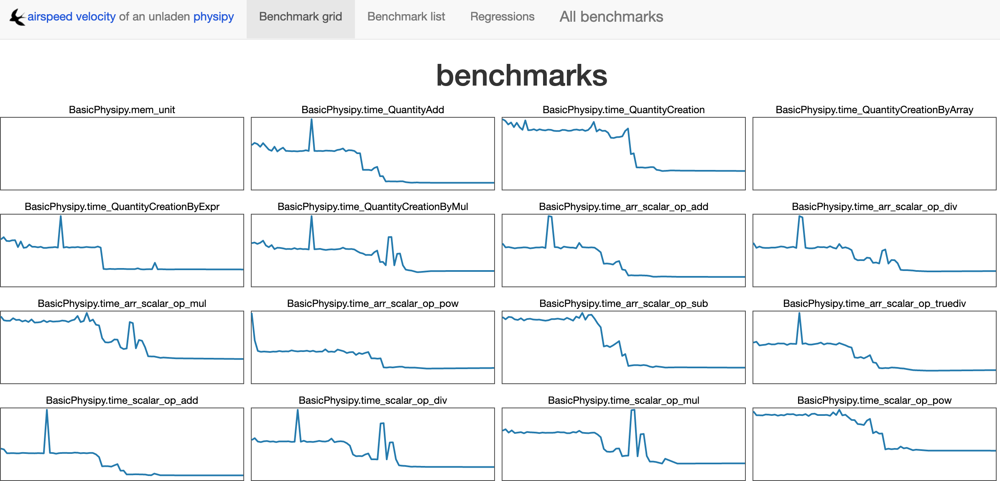

# Setup the environment

## General checks

 - `perflint physipy`

## Benchmarking versions

Benchmark results using [asv](https://github.com/airspeed-velocity/asv) are available at [https://mocquin.github.io/physipy/](https://mocquin.github.io/physipy/) :

For more information, see the dedicated documentation page on [benchmarking with airspeedvelocity].

## For documentation

The documentation system of physipy is based on [mkdocs]. It relies additionnaly on [mkdocs-material] for easy customisation and [mkdocstrings] to automaticaly include all physipy's docstrings into the documentation.

 - `pip install mkdocs`
 - `pip install mkdocs-material`
 - `pip install mkdocstrings[python]`
 - `pip install markdown_include` : to include the repo README.md directly into the documentation site

The documentation configuration is set in the `mkdocs.yml` configuration file at the root of the project.

The raw documentation is stored in the [docs] directory as markdown files. 

During development, cd to physipy root directory, and run the following command to launch a live server :
`mkdocs serve`

Please note that this only serves the documentation, and does not export it to an actual static-website.
To export the documentation to a static-website use : 
`mkdocs build`

This will generate the content to a directory given by `site_dir` in the `mkdocs.yml` configuration file (currently in `_mkdocs_site`).