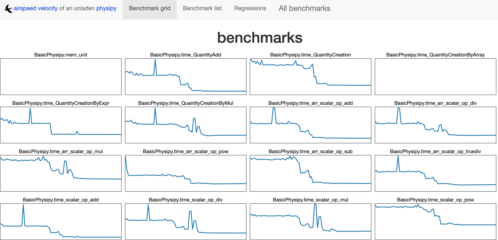

# Development guide

physipy uses [uv](https://docs.astral.sh/uv/) for environment and dependency
management. All project metadata, dependencies, and tool configuration live in a
single [`pyproject.toml`](https://github.com/mocquin/physipy/blob/master/pyproject.toml).

## Setup

```bash
git clone https://github.com/mocquin/physipy
cd physipy
uv sync --all-extras            # core + optional extras + the `dev` group
pre-commit install              # run lint/format/type checks on commit
```

(With plain pip: `pip install -e ".[all]"` and `pip install --group dev`.)

## Testing

Run the test suite with pytest:

```bash
pytest
pytest --cov                    # with coverage (pytest-cov)
```

Doctests can be collected too:

```bash
pytest --doctest-modules physipy
```

## Linting, formatting and imports

[Ruff](https://docs.astral.sh/ruff/) handles linting, import sorting, and
formatting (configured under `[tool.ruff]` in `pyproject.toml`):

```bash
ruff check .                    # lint (add --fix to autofix)
ruff format .                   # format (add --check to verify only)
```

## Type checking

physipy ships inline type hints (PEP 561, via the `py.typed` marker). Check them
with [mypy](https://mypy-lang.org/) (configured under `[tool.mypy]`):

```bash
mypy
```

## Benchmarking

Performance is tracked with [asv](https://github.com/airspeed-velocity/asv);
results are published at [https://mocquin.github.io/physipy/](https://mocquin.github.io/physipy/).

[](https://mocquin.github.io/physipy/)

See the [benchmarking with airspeed velocity](dev-benchmarking-with-asv.md) page
for details.

## Documentation

The docs are built with [mkdocs](https://www.mkdocs.org/),
[Material for MkDocs](https://squidfunk.github.io/mkdocs-material/), and
[mkdocstrings](https://mkdocstrings.github.io/) (which pulls physipy's docstrings
into the API reference). The configuration is in `mkdocs.yml`; the docs
dependencies are declared in the `docs` dependency group of `pyproject.toml`.

```bash
uv sync --group docs            # install the docs toolchain
mkdocs serve                    # live preview at http://127.0.0.1:8000
mkdocs build                    # build the static site into _mkdocks_site/
```

Documentation pages live in [`docs/`](https://github.com/mocquin/physipy/tree/master/docs)
as Markdown. Some pages are authored as notebooks and converted back and forth:

```bash
jupyter nbconvert --to markdown docs/scientific-stack/math-support.ipynb
jupytext --to ipynb docs/scientific-stack/numpy-support.md
```

The site is hosted on [Read the Docs](https://physipy.readthedocs.io/); the build
is driven by `.readthedocs.yaml`, which installs the `docs` group with uv and runs
`mkdocs build`.

## Releasing

The version is the single value in
[`physipy/_version.py`](https://github.com/mocquin/physipy/blob/master/physipy/_version.py)
(read at build time by hatchling). To cut a release:

1. Bump `__version__` in `physipy/_version.py`.
2. Build the distributions: `uv build` (or `python -m build`).
3. (Optional) smoke-test on TestPyPI: `uv publish --index testpypi`.
4. Publish to PyPI: `uv publish` (or `twine upload dist/*`).
5. Create a matching release/tag on
   [GitHub](https://docs.github.com/en/repositories/releasing-projects-on-github/managing-releases-in-a-repository).
