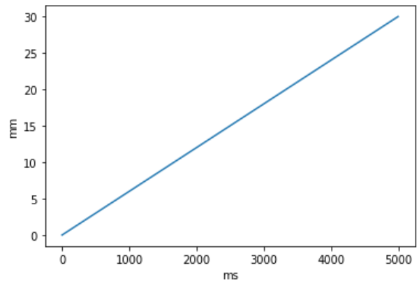

This site contains the project documentation for the
[`physipy`](https://github.com/mocquin/physipy/) project.

# physipy
[](https://mybinder.org/v2/gh/mocquin/physipy/HEAD)
[](https://badge.fury.io/py/physipy)

This python package allows you to manipulate physical quantities, basically considering in the association of a value (scalar, numpy.ndarray and more) and a physical unit (like meter or joule).

```python
>>> from physipy.quickstart import nm, hp, c, J
>>> E_ph = hp * c / (500 * nm)
>>> print(E_ph)
3.9728916483435158e-19 kg*m**2/s**2
>>> E_ph.favunit = J
>>> print(E_ph)
3.9728916483435158e-19 J
```

For a quickstart, check the [quickstart notebook](https://github.com/mocquin/physipy/blob/master/quickstart.ipynb) on the [homepage](https://github.com/mocquin/physipy)

## Try physipy online now [](https://mybinder.org/v2/gh/mocquin/physipy/HEAD)  
Get a live python session with physipy [by clicking here](https://mybinder.org/v2/gh/mocquin/physipy/HEAD). After a while, you'll get an interactive notebook session, then open the `quiskstart.ipynb` notebook in the left panel.

## Installation
The latest release of physipy is available on [pypi at https://pypi.org/project/physipy/](https://pypi.org/project/physipy/).
Hence the easiest way to install physipy is using pip : 
```
pip install physipy
```

Latest source code is hosted on [Github at https://github.com/mocquin/physipy/](https://github.com/mocquin/physipy/).
You can download and un-zip the package localy, or clone the git repository with : 
```
git clone https://github.com/mocquin/physipy
```
For more information, see [here](https://docs.github.com/fr/repositories/creating-and-managing-repositories/cloning-a-repository).

## Why choose this package  
Here are some reasons that might encourage you to choose this package for quantity/physical/units handling in python : 

 - Light-weight package (2 classes, few helper functions - the rest is convenience)
 - Great numpy compatibility (see below)
 - Great pandas compatibility (see below)
 - Great matplotlib compatibility (see below)
 - As fast (if not faster) than the main other units packages (see below)

Also : 

 - lots of unit tests  
 - computation performances tracked with airspeed-velocity (see below)  
 - Jupyter widgets that handle units (as ipywidgets and Qt, see below)  

## Documentation
The full documentation of physipy is under progress.

## Goals of the project
The project focuses on keeping these goals in the center of any new development : 

- Few LOC
- Simple architecture, with only 2 classes (namely `Dimension` and `Quantity`)
- High numpy compatibility
- Human-readable syntax (fast syntax !)
 
## Implementation approach

If you're only interested in using physipy, you don't need to understand this part (thou it wouldn't hurt to read it) : 

- a `Dimension` object represents a [physical dimension](https://en.wikipedia.org/wiki/Dimensional_analysis). For now, these dimension are based on the [SI unit](https://en.wikipedia.org/wiki/International_System_of_Units). It is basically a dictionary where the keys represent the base dimensions, and the values are the exponent these dimensions.
- a `Quantity` object is simply the association of a value, scalar or array (or more!), and a `Dimension` object. Note that this `Quantity` class does not sub-class numpy's `ndarray` (although `Quantity` instances are compatible with numpy's ufuncs, see below). **Most of the work is done by this class**.
- By default, a `Quantity` is displayed in term of SI untis. To express a `Quantity` in another unit, just set the "favunit", which stands for "favorit unit" of the `Quantity` : ```my_toe_length.favunit = mm```.
- Plenty of common units (ex : Watt) and constants (ex : speed of light) are packed in. Your physical quantities (```my_toe_length```), units (```kg```), and constants (```kB```) are all `Quantity` objects.

## Numpy's support

One the biggest strength of physipy is its numpy support :

```python
import numpy as np
from physipy import m, units

mm = units['mm']

lengths = np.linspace(-3*m, 4.5*m, 12*mm)
print(lengths[4])
print(lengths.mean())
```

Numpy is almost fully and transparently handled in physipy : basic operations, indexing, numpy functions and universal functions are handled. There are more than 150 functions implemented ! Some limitations still exist but can be can be circumvented.
See [the documentation for numpy support here](scientific-stack/numpy-support.md).

## Pandas' support

Pandas can be interfaced with physipy through the extension API exposed by pandas. For this, just install the package [`physipandas`](https://github.com/mocquin/physipandas). You can then use `pd.Series` and `pd.DataFrame` whilst keeping the meaningfull units. Checkout the dedicated repo for [physipandas](https://github.com/mocquin/physipandas) for more information.

```python
import pandas as pd
import numpy as np
from physipy import m
from physipandas import QuantityDtype, QuantityArray

# definition is a bit verbose...
c = pd.Series(QuantityArray(np.arange(10)*m), 
              dtype=QuantityDtype(m))

print(type(c))                 # --> <class 'pandas.core.series.Series'>
print(c.physipy.dimension)     # --> : L
print(c.physipy.values.mean()) # --> : 4.5 m
c

0   0
1   1
2   2
3   3
4   4
5   5
6   6
7   7
8   8
9   9
dtype: physipy[1 m]
```

## Matplotlib's units support

Matplotlib allows defining a physical units interface, which can be turned-on using physipy's `setup_matplotlib`, all plot involving a physical quantity will automatically label the axis accordingly : 
```python
import numpy as np
import matplotlib.pyplot as plt
from physipy import s, m, units, setup_matplotlib
setup_matplotlib() # make matplotlib physipy's units aware
mm = units["mm"]   # get millimiter
ms = units["ms"]   # get millisecond

# physipy work
x = np.linspace(0, 5) * s
x.favunit = ms 
y = np.linspace(0, 30) * mm
y.favunit = mm 

# standard matplotlib
fig, ax = plt.subplots()
ax.plot(x, y)
```



See [the documentation for matplotlib support here](scientific-stack/matplotlib-support.md).

## Widgets

Some ipywidgets and PyQt widgets are provided to make your physical researches and results more interactive : everything is stored in a separate package.

## License

This project is licensed under the MIT License - see the [LICENSE.md](https://github.com/mocquin/physipy/LICENSE.md) file for details

## Acknowledgment

Thumbs up to phicem and his [pysics](https://github.com/Phicem/pysics) package, on which this package was highly inspired. Check it out !


[Open project on Github](https://github.com/mocquin/physipy/){ .md-button .md-button--primary }
