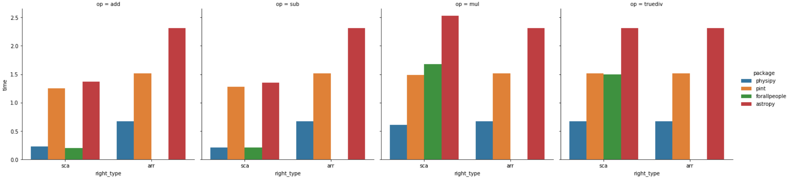
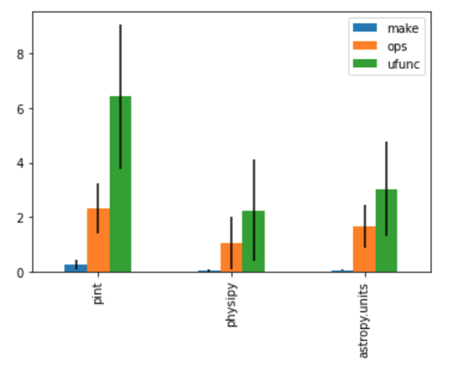

# Alternative packages

Python has a surprisingly large number of packages for working with physical
quantities and units. This page compares the most popular ones with physipy —
their design choices, strengths, and trade-offs — so you can pick the right tool
for your problem. The aim is to be fair: physipy is not the best choice for every
use case, and this page tries to make clear when another package fits better.

## At a glance

| Package | Quantity model | Unit registry? | Angles as a dimension | Core dependency | Best suited for |
| --- | --- | --- | --- | --- | --- |
| **physipy** | wrapper (value + `Dimension`), *not* an `ndarray` subclass | no — units are module-level objects | **yes** (`rad`, `sr` are base dimensions) | numpy only | general scientific/engineering code that wants a lean, numpy-friendly library |
| **pint** | wrapper (magnitude + `Unit`), tied to a registry | **yes** — `UnitRegistry()` required | no (radian is dimensionless) | numpy optional | rich unit string parsing, contexts, the largest unit database |
| **astropy.units** | `Quantity` **subclasses** `ndarray` | no | no | astropy (heavy) | astronomy, and `equivalencies` for non-trivial conversions |
| **unyt** | `unyt_array` **subclasses** `ndarray` | module-level + registry | no | numpy | fast array-heavy work (born in the `yt` project) |
| **quantities** | `Quantity` **subclasses** `ndarray` | no | no | numpy | a long-standing numpy-centric option |
| **forallpeople** | scalar `Physical` objects, auto SI rendering | environment of units | no | numpy (light) | engineering calculations and notebooks (scalar-focused) |
| **numericalunits** | *no type at all* — units are float scale factors | no | no | none | zero-overhead code where you accept no dimensional safety |
| **sympy.physics.units** | symbolic expressions | no | no | sympy | exact/symbolic algebra inside a CAS |

The rows below explain the column choices in more detail.

## How physipy is built (recap)

Understanding physipy's design makes the comparison concrete. physipy is built on
**two** classes:

- A **`Dimension`** is a dictionary of exponents over the SI base dimensions.
  Notably, physipy includes **plane angle (`rad`) and solid angle (`sr`) as base
  dimensions**, alongside the usual seven (length, mass, time, current,
  temperature, amount, luminous intensity).
- A **`Quantity`** is simply a value paired with a `Dimension`. It **does not
  subclass `numpy.ndarray`** — it *wraps* a value, which can be a Python scalar,
  a numpy array, or other numeric-like objects. numpy compatibility is provided
  through numpy's `__array_ufunc__` / `__array_function__` protocols (150+
  functions supported).

Two consequences follow, and they're the crux of most differences below:

1. **Wrapper, not subclass.** Because a `Quantity` wraps its value rather than
   *being* an array, the value type is flexible (float, `Decimal`, arrays,
   `uncertainties`/`mcerp` objects, …), and physipy avoids the well-known
   pitfalls of subclassing `ndarray`. The cost is that numpy functions must be
   explicitly supported (most common ones are).
2. **Units are plain objects, not a registry.** `m`, `units["mm"]`,
   `constants["c"]` are all just `Quantity` instances. There is no registry to
   instantiate and no notion of incompatible registries.

## The main alternatives

### pint

The most popular units package. A `Quantity` is a magnitude plus a `Unit`, both
managed by a **`UnitRegistry`** that you must instantiate (`ureg =
UnitRegistry()`, then `3 * ureg.meter`). Strengths: an enormous unit database,
excellent **string parsing** (`ureg("3.0 m/s")`), and **contexts** for
non-multiplicative conversions (e.g. spectroscopy). numpy is optional.

*Versus physipy:* pint's registry is powerful but adds ceremony, and quantities
from different registries don't interoperate; physipy's units are global objects
with no registry. pint derives dimensionality from registry definitions, whereas
physipy carries an explicit `Dimension`. If you need rich string parsing or
contexts, pint is the stronger choice today.

### astropy.units

Battle-tested and excellent, but part of the (large) astropy project. Its
`Quantity` **subclasses `ndarray`**, so it behaves like an array everywhere. Its
standout feature is **`equivalencies`** — declarative rules for conversions that
aren't simple scalings (spectral, temperature, parallax, …).

*Versus physipy:* astropy is heavier and astronomy-oriented; subclassing
`ndarray` makes quantities drop-in arrays at the cost of subclassing edge cases.
physipy is standalone and lean, and wraps rather than subclasses. physipy has no
general equivalency framework (see [Limitations](#limitations-of-physipy)).

### unyt

From the `yt` project, focused on fast operations on large arrays.
`unyt_array` **subclasses `ndarray`**. Mature and performant for array-heavy
numeric work.

*Versus physipy:* same subclass-vs-wrapper trade-off as astropy/quantities.
physipy's wrapper lets the underlying value be non-array types; unyt is
specifically an array.

### quantities

One of the older numpy-centric packages; `Quantity` **subclasses `ndarray`**.
Similar trade-offs to unyt/astropy, with a smaller feature set and slower
development pace.

### forallpeople

Aimed at **engineering** workflows: it renders results in the most readable SI
form automatically (e.g. combining into newtons or pascals) and is delightful in
notebooks. It is primarily **scalar-oriented**.

*Versus physipy:* forallpeople optimizes for human-readable SI rendering of
scalars; physipy targets general numpy-array computation with explicit
favourite-unit control.

### numericalunits

A fundamentally different idea: there is **no quantity type**. Each unit is just a
(pseudo-random) float scale factor; you multiply on input and divide on output.
This has **zero runtime overhead** and works with any numeric code — but it
performs **no dimensional checking**. Errors are caught only statistically, by
re-running with different random unit values.

*Versus physipy:* opposite ends of the spectrum. physipy enforces dimensions at
every operation; numericalunits enforces nothing and costs nothing.

### sympy.physics.units

Symbolic units inside the SymPy CAS: exact rational arithmetic and algebraic
manipulation, at the cost of numeric performance.

*Versus physipy:* use SymPy when you want symbolic/exact work; use physipy for
fast numeric computation on floats and arrays. (physipy uses SymPy only
optionally, for parsing dimension strings and LaTeX rendering.)

## physipy: pros and cons

**Pros**

- **Lean** — only numpy is required; scipy, matplotlib and sympy are optional
  extras. Easy to add as a dependency.
- **Flexible value type** — wrapping (not subclassing) means the value can be a
  float, a numpy array, a `Decimal`, or `uncertainties`/`mcerp` objects.
- **Angle safety** — radian and steradian are real dimensions, so mixing an angle
  with a dimensionless number is caught instead of silently ignored.
- **Simple mental model** — two classes; units and constants are ordinary
  `Quantity` objects with no registry to manage.
- **Good ecosystem hooks** — numpy ufuncs/functions, matplotlib axis labels, and
  pandas via [`physipandas`](https://github.com/mocquin/physipandas).
- **Competitive performance** — see [below](#performance).

**Cons / limitations**

- **Smaller community** than pint or astropy — fewer answered questions, plugins
  and battle-tested edge cases.
- **No general equivalency/context system** for non-multiplicative conversions
  (astropy's `equivalencies`, pint's contexts). Conversions are
  multiplicative-by-dimension.
- **Limited quantity string parsing** — physipy parses *dimension* strings (with
  the optional sympy extra) but not full quantity strings like pint's `"3 m/s"`.
- **numpy coverage is explicit** — the wrapper approach means a numpy function
  works only if it has been wired in (most common ones are; some exotic ones are
  not).
- The angle-as-dimension choice occasionally requires explicitly dropping the
  `rad` dimension when interfacing with code that expects dimensionless radians.

## Performance

A dedicated, reproducible benchmark compares physipy with pint, astropy and
forallpeople on speed *and* operation coverage — see
[Performance vs other packages](../development-guide/dev-performance-comparison.md)
for the full tables and chart.

A quick benchmark shows physipy is as fast as (or faster than) other well-known
packages, for both scalars and numpy arrays:

For a more in-depth, reproducible comparison, see
[mocquin/quantities-comparison](https://github.com/mocquin/quantities-comparison):

## The full landscape

Many more packages exist (roughly by popularity):
[astropy](http://www.astropy.org/astropy-tutorials/Quantities.html) ·
[sympy](https://docs.sympy.org/latest/modules/physics/units/philosophy.html) ·
[pint](https://pint.readthedocs.io/en/latest/) ·
[forallpeople](https://github.com/connorferster/forallpeople) ·
[unyt](https://github.com/yt-project/unyt) ·
[python-measurement](https://github.com/coddingtonbear/python-measurement) ·
[Unum](https://bitbucket.org/kiv/unum/) ·
[scipp](https://scipp.github.io/reference/units.html) ·
[magnitude](http://juanreyero.com/open/magnitude/) ·
[numericalunits](https://github.com/sbyrnes321/numericalunits) ·
[buckingham](https://github.com/mdipierro/buckingham) ·
[quantities](https://pythonhosted.org/quantities/user/tutorial.html) ·
[brian](https://brian2.readthedocs.io/en/stable/user/units.html) ·
[quantiphy](https://github.com/KenKundert/quantiphy) ·
[pynbody](https://github.com/pynbody/pynbody) ·
[pyansys-units](https://github.com/ansys/pyansys-units) ·
[natu](https://github.com/kdavies4/natu) ·
[misu](https://github.com/cjrh/misu) ·
[openscm-units](https://github.com/openscm/openscm-units) ·
and [pysics](https://bitbucket.org/Phicem/pysics), from which physipy was
originally inspired.

If you know another package not listed here, contributions are welcome. For
broader context on the topic, see the
[quantities-comparison](https://github.com/tbekolay/quantities-comparison) repo,
[this talk](https://www.youtube.com/watch?v=N-edLdxiM40), and this
[comparison table](https://socialcompare.com/en/comparison/python-units-quantities-packages).

There are C/C++ alternatives too, such as
[units](https://units.readthedocs.io/en/latest/index.html).
